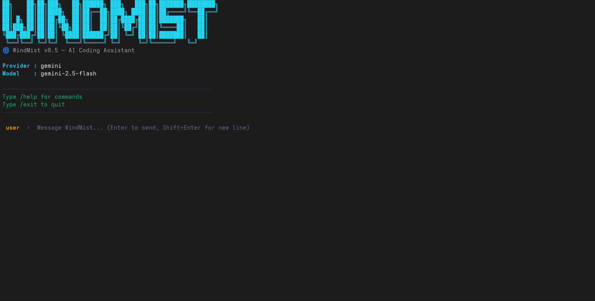

<div align="center">

# 🌀 WindMist `v1.0.0`
### Autonomous AI Software Engineer Running Directly in Your Terminal


<br/>

[](CHANGELOG.md)
[](LICENSE)
[](https://golang.org)
[](https://python.org)
[](CONTRIBUTING.md)

**A modern open-source AI coding assistant running right inside your terminal.**  
WindMist (`v1.0.0`) is built in high-performance Go to inspect code, edit files atomically across your workspace, and engage in multi-turn reasoning loops with local tools.

> **🌐 Official Website:** [windmist.vercel.app](https://windmist.vercel.app/) &nbsp;|&nbsp; **💻 Website Repo:** [`windmist-site`](https://github.com/Nithwin/windmist-site)

[🌐 Website](https://windmist.vercel.app/) • [Demo](#-demo) • [Installation](#-installation) • [Quick Start](#-quick-start) • [Features](#-features--capabilities) • [Commands](#-core-commands) • [Architecture](docs/architecture.md) • [Contributing](CONTRIBUTING.md)

</div>

---

## 📺 Demo

Experience an interactive AI pair programming session directly in your terminal:

<div align="center">
  
</div>

---

## ⚙️ Installation

To install `windmist` (`v1.0.0`) using the Go toolchain (`Go 1.25+` required):

```bash
go install github.com/your-username/windmist/cmd/windmist@latest
```

Or clone and build directly from source:

```bash
git clone https://github.com/your-username/windmist.git
cd windmist
go build -o windmist ./cmd/windmist
```

---

## 🚀 Quick Start

1. **Set your Gemini API Key** (or export it in your environment):
   ```bash
   export GEMINI_API_KEY="your-gemini-api-key"
   ```
2. **Launch the interactive Terminal UI:**
   ```bash
   ./windmist
   ```
3. **Or run a single-turn prompt directly against your repository:**
   ```bash
   ./windmist chat "Examine internal/agent and summarize the tool loop"
   ```

---

## ✨ Features & Capabilities

WindMist (`v1.0.0`) provides a robust, native engineering environment inside your terminal:

* ✅ **Interactive AI Chat & TUI:** Rich Bubble Tea and Lip Gloss interface with real-time streaming, markdown rendering, and syntax coloring.
* ✅ **Native Gemini Provider (`internal/providers/gemini`):** Full multi-turn conversation support with native `OBJECT` schema translation and function calling (`v1beta`).
* ✅ **15 Atomic Filesystem & Editing Tools (`internal/tools/...`):**
  * **Filesystem Operations:** `read`, `write`, `append`, `delete`, `rename`, `list`, `create`, `info`, `exists`.
  * **Precision Editing:** `replace_text`, `replace_range`, `delete_range`, `read_context`, `insert_text`, `search_text`.
* ✅ **Autonomous Agent Loop (`internal/agent`):** Stateless multi-turn reasoning loop with automated tool execution, context tracking, and self-correction.

---

## 🛠️ Core Commands

| Command | Description |
| :--- | :--- |
| `windmist` | Launch the rich interactive Bubble Tea Terminal UI session. |
| `windmist chat <prompt>` | Run a single-turn or multi-turn agent instruction directly from the command line. |
| `windmist set <key> <val>` | Configure local environment and provider settings (`~/.windmist/config.yaml`). |
| `windmist show` | Display current local configuration settings. |
| `windmist version` | Print current semantic release build version (`v1.0.0`). |

---

## 💡 Why WindMist?

Our mission is to provide an open-source AI coding assistant that operates with native execution speed, deep workspace awareness, and complete local sovereignty over your development workflows.

Most AI CLI tools struggle with sluggish startup times or cumbersome configuration requirements. WindMist eliminates this overhead by isolating everything close to your terminal—CLI parsing, interactive Bubble Tea UX, concurrent file walking, and the autonomous tool execution loop—strictly inside a high-performance Go core (`internal/`).

---

## 📐 Architecture Overview

For a comprehensive breakdown of our system architecture, domain-driven Go modules (`internal/`), and multi-turn execution loop, please read **[`docs/architecture.md`](docs/architecture.md)**.

---

## 🤝 Contributing

Whether you are fixing bugs, improving documentation, or designing new tools, we treat this project with the engineering rigor of a top-tier open-source product:
* **Users & Newcomers:** Check out our [Quick Start](#-quick-start) to begin pairing with WindMist.
* **Contributors:** Please review **[`CONTRIBUTING.md`](CONTRIBUTING.md)** for local setup, branch conventions (`feat/`, `fix/`), and our testing rules (`go test ./...`).
* **Security:** Review **[`SECURITY.md`](SECURITY.md)** for our threat models (`Workspace boundaries`, `Tool permissions`, `Unsafe commands`).

---

## 📄 License

This project is licensed under the **MIT License** — see the [`LICENSE`](LICENSE) file for details.

---

<div align="center">
  <sub>Built with ❤️ for the next generation of autonomous engineering in the terminal.</sub>
</div>
