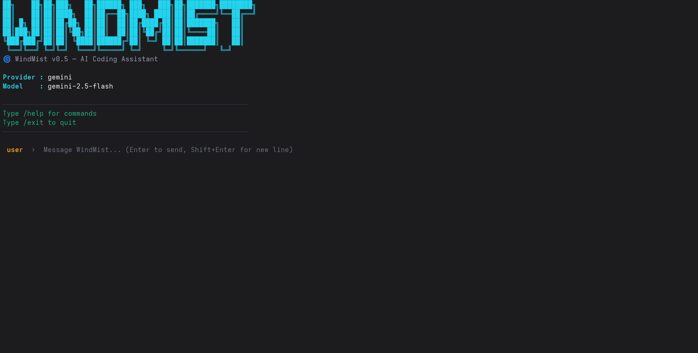

<div align="center">

# 🌀 WindMist `v1.0.0`
### Simple Terminal AI Assistant Running Directly in Your Terminal


<br/>

[](CHANGELOG.md)
[](LICENSE)
[](https://golang.org)
[](https://discord.gg/9hNxQdHYX)
[](CONTRIBUTING.md)

**A simple open-source AI assistant running right inside your terminal.**
WindMist (`v1.0.0`) is built in Go to let you chat with an AI model and work with files using a small set of beginner-friendly tools.

> **🌐 Official Website:** [windmist.vercel.app](https://windmist.vercel.app/) &nbsp;|&nbsp; **💻 Website Repo:** [`windmist-site`](https://github.com/Nithwin/windmist-site) &nbsp;|&nbsp; **💬 Community:** [Discord](https://discord.gg/9hNxQdHYX)

[Demo](#-demo) • [Installation](#-installation) • [Quick Start](#-quick-start) • [Features](#-features--capabilities) • [Commands](#-core-commands) • [Architecture](docs/architecture.md) • [Build Guide](docs/build-windmist.md) • [Contributing](CONTRIBUTING.md)

</div>

---

## 📺 Demo

Experience an interactive AI pair programming session directly in your terminal:

<div align="center">
  
</div>

---

## ⚙️ Installation

To install `windmist` (`v1.0.0`) using the Go toolchain (`Go 1.25+` required):

```bash
go install github.com/your-username/windmist/cmd/windmist@latest
```

Or clone and build directly from source:

```bash
git clone https://github.com/your-username/windmist.git
cd windmist
go build -o windmist ./cmd/windmist
```

---

## 🚀 Quick Start

1. **Set your Gemini API Key** (or export it in your environment):
   ```bash
   export GEMINI_API_KEY="your-gemini-api-key"
   ```
2. **Launch the interactive Terminal UI:**
   ```bash
   ./windmist
   ```
3. **Or run a single-turn prompt directly against your repository:**
   ```bash
   ./windmist chat "Examine internal/agent and summarize the tool loop"
   ```

---

## ✨ What This Basic Version Includes

WindMist (`v1.0.0`) keeps the first version small and easy to learn:

* ✅ **Terminal Chat:** Run `windmist` and talk to the assistant in your terminal.
* ✅ **One Provider by Default:** Gemini is the default provider in this branch.
* ✅ **Basic File Tools:** `read`, `write`, `list`, and one simple edit tool.
* ✅ **Simple Agent Loop:** The assistant can read a prompt, use a tool, and reply.

---

## 🛠️ Core Commands

| Command | Description |
| :--- | :--- |
| `windmist` | Launch the rich interactive Bubble Tea Terminal UI session. |
| `windmist chat <prompt>` | Run a single-turn or multi-turn agent instruction directly from the command line. |
| `windmist set <key> <val>` | Configure local environment and provider settings (`~/.windmist/config.yaml`). |
| `windmist show` | Display current local configuration settings. |
| `windmist version` | Print current semantic release build version (`v1.0.0`). |

---

## 💡 Why This Basic Version?

This branch is meant to be easy to follow for beginners.

It keeps the flow small: start the app, send a prompt, read a file, write a file, and get an answer.

---

## 📐 Architecture Overview

For the full architecture, read **[`docs/architecture.md`](docs/architecture.md)**.

## 🧭 Build Guide

If you want to recreate WindMist step by step, start with **[`docs/build-windmist.md`](docs/build-windmist.md)**. It explains how to build the app in simple language with small examples.

## 📘 What Is Included

If you want a very short summary of the branch, read **[`docs/basic-version.md`](docs/basic-version.md)**.

---

## 🤝 Contributing

Whether you are fixing bugs, improving documentation, or designing new tools, we treat this project with the engineering rigor of a top-tier open-source product:
* **Users & Newcomers:** Check out our [Quick Start](#-quick-start) to begin pairing with WindMist.
* **Contributors:** Please review **[`CONTRIBUTING.md`](CONTRIBUTING.md)** for local setup, branch conventions (`feat/`, `fix/`), and our testing rules (`go test ./...`).
* **Security:** Review **[`SECURITY.md`](SECURITY.md)** for our threat models (`Workspace boundaries`, `Tool permissions`, `Unsafe commands`).

---

## 📄 License

This project is licensed under the **MIT License** — see the [`LICENSE`](LICENSE) file for details.

---

<div align="center">
  <sub>Built with ❤️ for the next generation of autonomous engineering in the terminal.</sub>
</div>
