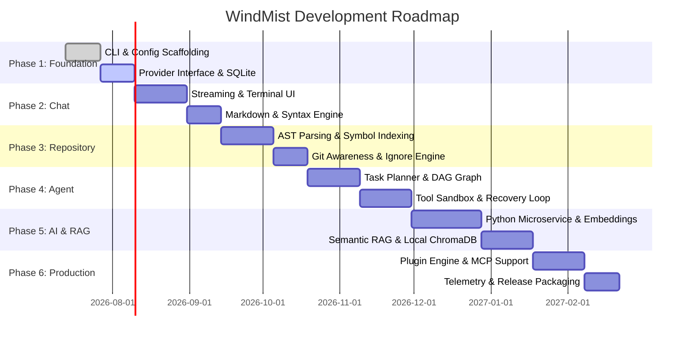

# WindMist Product Roadmap & Execution Plan

We are building **WindMist** with the discipline, focus, and velocity of an early-stage AI engineering product. Our development roadmap is broken down into **6 distinct, iterative phases**, moving from high-speed local CLI scaffolding up to a fully autonomous, production-grade terminal software engineer.

---

## Phase Overview

---

## 🏁 Phase 1 — Foundation (Completed)

**Goal:** Establish the high-performance Go skeleton, configuration infrastructure, and unified LLM provider interface.

### Key Deliverables:
- [x] **Project Vision & Architecture Planning (`README.md`, `ARCHITECTURE.md`, `CONTRIBUTING.md`)**
- [x] **CLI Framework Setup (`internal/cli` & `cmd/windmist`)**
  - Integrate Cobra for command structure (`chat`, `review`, `fix`, `doctor`, `auth`).
  - Implement basic terminal logging using Go standard library `slog`.
- [x] **Configuration & Secrets Engine (`internal/config`)**
  - Integrate Viper to manage `~/.windmist/config.yaml`.
  - Build secure OS keyring integration or encrypted local storage for API keys (`GEMINI_API_KEY`, `OPENAI_API_KEY`, etc.).
- [x] **Unified Provider Interface (`internal/providers`)**
  - Define standard `Provider` Go interface with streaming support (`<-chan *CompletionChunk`).
  - Implement initial mock and live Gemini 3.0 / OpenAI streaming adapters.
- [x] **Local Storage Initialization (`internal/memory`)**
  - Scaffolding pure-Go SQLite connections (`~/.windmist/history.db`).

---

## 💬 Phase 2 — Interactive Chat & Terminal UI (Completed)

**Goal:** Deliver a world-class, fluid terminal pairing experience with instant streaming and beautiful syntax highlighting.

### Key Deliverables:
- [x] **Interactive Terminal UI (`internal/cli`)**
  - Build responsive viewport controllers using **Bubble Tea** and **Lip Gloss**.
  - Add real-time token counter displays and active model badges.
- [x] **Streaming & Markdown Rendering (`internal/streaming`)**
  - Implement asynchronous Server-Sent Events (SSE) parsing.
  - Render GitHub-flavored Markdown tables and code blocks dynamically.
  - Integrate `chroma` or custom Go highlighting engines for multi-language syntax coloring.
- [x] **Multi-Turn Session Memory (`internal/session`)**
  - Persist conversation turns automatically to SQLite (`history.db`).
  - Add context-window pruning to manage long conversations gracefully.

---

## 🗂️ Phase 3 — Repository Awareness & Symbol Indexing (Completed)

**Goal:** Give WindMist sight. Enable the CLI to understand project boundaries, file structures, and symbols instantaneously.

### Key Deliverables:
- [x] **High-Concurrency File Indexer (`internal/repository` & `internal/tools/filesystem`)**
  - Implement Goroutine worker pools and atomic filesystem tools (`read`, `write`, `list`, `info`, `exists`).
  - Build strict `.gitignore` and `.windmistignore` filtering (`ignore` package integration).
- [x] **Lightweight AST & Code Context Engine (`internal/tools/editing`)**
  - Implement exact string and range replacement tools (`replace_text`, `replace_range`, `read_context`, `insert_text`).
- [x] **Git Awareness (`internal/git`)**
  - Inspect current branch status, uncommitted changes, and git diff summaries (`go-git` / native CLI wrapper).

---

## 🤖 Phase 4 — The Autonomous Agent & Tool Sandbox (`v1.0.0 Live`)

**Goal:** Transition WindMist from a passive chat advisor into an autonomous engineering partner capable of multi-file edits and error recovery.

### Key Deliverables:
- [x] **Stateless Agent Loop (`internal/agent`)**
  - Implement multi-turn reasoning loop coordinating tool execution, metrics tracking, and token limits (`Run` and `runLoop`).
- [x] **Core Tool Suite (`internal/tools/defaults`)**
  - `ReadFileTool` / `WriteFileTool`: Safe, atomic file mutations.
  - `SearchTool`: Regex and text-based workspace search.
  - `ReplaceTool` / `RangeTool`: Precision code editing without full file overwrites.
- [x] **Native Gemini Tool Calling (`internal/providers/gemini`)**
  - Schema translation converting Go tool definitions into Gemini `v1beta` function declarations (`OBJECT` schema).
  - Multi-turn conversation mapping separating user prompts, model function calls (`FunctionCall`), and tool results (`FunctionResponse`).
- [x] **User Safety & Turn Limits**
  - Structured turn limit enforcement (`ErrMaxTurnsExceeded`) to prevent runaway execution loops.

---

## 🧠 Phase 5 — Advanced AI & RAG Service (Python Integration)

**Goal:** Launch our decoupled Python microservice to unlock deep vector embeddings, local semantic search, and project evaluation.

### Key Deliverables:
- [ ] **Lightweight Python Microservice (`python/server`)**
  - Scaffolding high-performance **FastAPI** server running cleanly on localhost loopback.
- [ ] **Semantic Embedding Engine (`python/embeddings`)**
  - Integrate `sentence-transformers` for local or remote code embedding generation.
- [ ] **Vector Indexing & RAG (`python/rag`)**
  - Integrate **ChromaDB** or **Qdrant** for semantic vector storage inside `~/.windmist/cache/`.
  - Enable queries like *"Find where user authentication tokens are validated"* without exact keyword matching.
- [ ] **Go <-> Python Interop (`internal/providers` & `python/`)**
  - Establish low-latency local HTTP/JSON routing between Go CLI and Python RAG service.

---

## 🚀 Phase 6 — Production & Ecosystem Scaling

**Goal:** Prepare WindMist for widespread open-source adoption, extensible plugin development, and cross-platform distribution.

### Key Deliverables:
- [ ] **Model Context Protocol (MCP) Integration (`plugins/`)**
  - Support standard MCP client specs so developers can connect custom database tools, Jira integrations, and cloud monitoring servers directly to WindMist.
- [ ] **Custom Plugin Engine**
  - Allow users to write shared object plugins (`.so` or external binaries) that conform to our Go `Tool` interface.
- [ ] **Optional Privacy-First Telemetry (`internal/telemetry`)**
  - Local diagnostic logs (`~/.windmist/logs/`) for agent latency and failure modes.
  - Completely opt-in anonymized performance reporting.
- [ ] **Cross-Platform Packaging & CI/CD (`Makefile` & `.github/`)**
  - Configure **Goreleaser** to build signed, zero-dependency binaries for Linux, macOS (Apple Silicon + Intel), and Windows.
  - Publish official Homebrew taps, Apt repositories, and Docker devcontainer templates.
